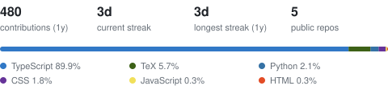

- [bridge](https://github.com/aryankori/bridge): agent interoperability and orchestration layer (TypeScript)
- [quant-trading-portfolio-suite](https://github.com/aryankori/quant-trading-portfolio-suite): options pricing, risk metrics, and strategy backtesting with a Flask dashboard (Python)
- [llm-runner](https://github.com/aryankori/llm-runner): portable local LLM server, a Go watchdog around Ollama (Go)
- [ai-redteam-harness](https://github.com/aryankori/ai-redteam-harness): security test harness for local LLM endpoints (Python)
- [estate-scout](https://github.com/aryankori/estate-scout): real estate scraping and analysis pipeline (TypeScript)
- [apple-stock-vs-iphone](https://github.com/aryankori/apple-stock-vs-iphone): AAPL returns vs. buying each iPhone, 2007-2026 (TypeScript)

<picture>
  <source media="(prefers-color-scheme: dark)" srcset="stats/stats-dark.svg" />
  
</picture>

